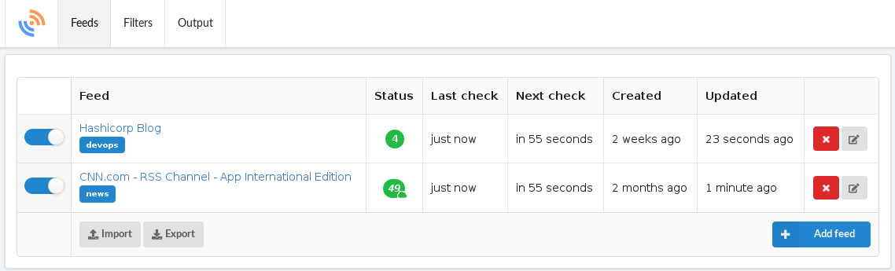

# feedpushr

[](https://github.com/ncarlier/feedpushr)
[](https://goreportcard.com/report/github.com/ncarlier/feedpushr)
[](https://hub.docker.com/r/ncarlier/feedpushr/)
[](https://www.paypal.me/nunux)

A simple feed aggregator service with sugar on top.


## Features

- Single executable with an embedded database.
- Manage feed subscriptions.
- Import/Export feed subscriptions with [OPML][opml] files.
- Aggressive and tunable aggregation process.
- Manage feed aggregation individually.
- Apply modifications on articles with a pluggable filter system.
- Push new articles to a pluggable output system (STDOUT, HTTP, EMAIL, [readflow][readflow], Twitter ...).
- Customize the pipeline thanks to a powerful expression language.
- Support of [WebSub][websub] the open, simple, web-scale and
  decentralized pubsub protocol.
- REST API with complete [OpenAPI][openapi] documentation.
- Authentication mechanisms such as OpenID Connect.
- Full feature Web UI and CLI to interact with the API.
- Metrics production for monitoring.
- Quota.

## Installation

Run the following command:

```bash
$ go get -v github.com/ncarlier/feedpushr/v3
```

**Or** download the binary regarding your architecture:

```bash
$ curl -s https://raw.githubusercontent.com/ncarlier/feedpushr/master/install.sh | bash
$ # Or with https://gobinaries.com/
$ curl -sf https://gobinaries.com/ncarlier/feedpushr | sh
```

**Or** use Docker:

```bash
$ docker run -d --name=feedpushr ncarlier/feedpushr
```

## Configuration

Feedpushr can be configured by using command line parameters or by setting environment variables.

Type `feedpushr -h` to display all parameters and related environment variables.

All configuration variables are described in [etc/default/feedpushr.env](./etc/default/feedpushr.env) file.

## Tags

You can define tags on feeds using the Web UI or the API:

```bash
$ curl -XPOST http://localhost:8080/v2/feeds?url=http://www.hashicorp.com/feed.xml&tags=foo,bar
```

Tags can also be imported/exported in OPML format. When using OMPL, tags are stored into the [category attribute][opml-category]. OPML category is a string of comma-separated slash-delimited category strings.
For example, this OMPL attribute `<category>/test,foo,/bar/bar</category>` will be converted to the following tag list: `test, foo, bar_bar`.

Once feeds are configured with tags, each new article will inherit these tags and be pushed out with them.

## Outputs

New articles are sent to outputs.

Currently, there are some built-in output providers:

| Output | Properties | Description |
|----------|----------|-------------|
| `stdout` | `format` | New articles are sent to the standard output of the process. This can be useful if you want to pipe the command to another shell command. *ex: Store the output into a file. Forward the stream via `Netcat`. Use an ETL tool such as [Logstash][logstash], etc.* |
| `http` | `url`<br>`contentType`<br>`format` | New articles are sent to an HTTP endpoint (POST). |
| `email` | `host`<br>`username`<br>`password`<br>`format`<br>... | New articles are sent by email to a SMTP host. |
| `readflow` | `url` (default: [official API][readflow-api] <br>`apiKey` | New articles are sent to [readflow][readflow] instance. |

Outputs can be extended using [plugins](#plugins).

### Conditional expression

Outputs are activated according to a conditional expression.
If the output has no condition it will be activated regardless of the input article.
Otherwise the expression will be applied to the article and its result will decide whether the output is used or not.

For example, if we want to use an output only on articles tagged *news* and mentioning *Paris* in their title.
We can use the following expression: `"news" in Tags and Title contains "Paris"`

The conditional expression language is documented [here](./EXPRESSION.md).

### Output format

For some outputs (`stdout`, `http` and some plugins) the output format is configurable.

If the format is not specified, the output will be formatted as the following JSON document:

```json
{
	"title": "Article title",
	"text": "Article text description",
	"content": "Article HTML content",
	"link": "Article URL",
	"updated": "Article update date (String format)",
	"updatedParsed": "Article update date (Date format)",
	"published": "Article publication date (String format)",
	"publishedParsed": "Article publication date (Date format)",
	"guid": "Article feed GUID",
  "feedTitle": "Feed title",
	"meta": {
		"key": "Metadata keys and values added by filters"
	},
	"tags": ["list", "of", "tags"]
}
```

If, on the other hand, you specify a format, it must comply with the [Golang template syntax](https://golang.org/pkg/text/template/).

Basically, you have access to the JSON properties above but prefixed with a dot and a capital letter all surrounded by 2 brackets.
For example, the `title` property is accessible with the syntax : `{{.Title}}`.

Let's say you want to send a JSON payload to a [Mattermost Webhook](https://docs.mattermost.com/developer/webhooks-incoming.html).
You can format the payload like this:

```json
{
	"text": ":tada: {{.Title}} (<{{.Link}}|more>) cc @all",
}
```

You can use [template functions](https://golang.org/pkg/text/template/#hdr-Functions) with some additions:

- `tweet <text> <suffix>`:
  Create a small message (text and a suffix) that don't exceed 270 characters. The `text` parameter can be truncated.
  *Example:* `"{{ tweet .Title .Link }}"`
- `truncate <length> <text>`: Truncate a text with a max length.
  *Example:* `"{{ truncate 200 .Text }}"`

## Filters

Before being sent, articles can be modified through a filter chain.

Currently, there are some built-in filter:

| Filter | Properties | Description |
|----------|---------|-------------|
| `title`  | `prefix` (default: `feedpushr:`)| This filter will prefix the title of the article with a given value. |
| `fetch`  | None       | This filter will attempt to extract the content of the article from the source URL. |
| `minify` | None       | This filter will minify the HTML content of the article. |

Filters can be extended using [plugins](#plugins). 

Like outputs, filters are activated according to a [conditional expression](#conditional-expression).
Filters are attached to an output, so they inherit the conditional expression of the output.

## Plugins

You can easily extend the application by adding plugins.

A plugin is a compiled library file that must be loaded when the application starts.

Plugins inside `$PWD` are automatically loaded.
You can also load a plugin using the `--plugin` parameter.

Example:

```bash
$ feedpushr --plugin ./feedpushr-twitter.so
```

You can find some external plugins (such as for Twitter) into this
[directory](./contrib).

## Launcher

Feedpushr can be started in "desktop mode" thanks to a launcher.
The purpose of `feedpushr-launcher` is to start the daemon and add an icon to your taskbar.
This icon allows you to control the daemon and quickly access the user interface.

## User Interface

You can access Web UI on http://localhost:8080/ui



## Authentication

You can restrict access to Feedpushr using HTTP basic authentication or OpenID Connect.

### Basic authentication

To activate basic authentication, you have to create a `htpasswd` file:

```bash
$ # create passwd file the user 'admin'
$ htpasswd -B -c .htpasswd admin
```
This command will ask for a password and store it in the htpawsswd file.

Please note that by default, Feedpushr will try to load the `.htpasswd` file.

But you can override this behavior by specifying the location of the file:

```bash
$ export FP_AUTHN=/etc/feedpushr.htpasswd
$ # or
$ feedpushr --authn /etc/webhookd/users.htpasswd
```

### OpenID Connect

To activate OIDC authentication, you have to specify OIDC issuer URL:

```bash
$ export FP_AUTHN=https://accounts.google.com
$ # or
$ feedpushr --authn https://accounts.google.com
```

Note that you can restrict access for a specific username like this:

```bash
$ export FP_AUTHORIZED_USERNAME=xxx
$ # or
$ feedpushr --authorized-username xxx
```

## Use cases

### Start the service

```bash
$ # Start service with default configuration:
$ feedpushr
$ # Start service with custom configuration:
$ export FP_DB="boltdb:///var/opt/feedpushr.db"
$ export FP_DELAY=20s
$ export FP_LOG_LEVEL=warn
$ feedpushr
```

### Add feeds

```bash
$ # Add feed with the CLI
$ feedpushr-ctl create feed --url http://www.hashicorp.com/feed.xml
$ # Add feed with cURL
$ curl -XPOST http://localhost:8080/v2/feeds?url=http://www.hashicorp.com/feed.xml
$ # Import feeds from an OPML file
$ curl -XPOST http://localhost:8080/v2/opml -F"file=@subscriptions.opml"
```

### Manage feeds

```bash
$ # List feeds
$ feedpushr-ctl list feed
$ # Get a feed
$ feedpushr-ctl get feed --id=9090dfac0ccede1cfcee186826d0cc0d
$ # Remove a feed
$ feedpushr-ctl delete feed --id=9090dfac0ccede1cfcee186826d0cc0d
$ # Stop aggregation of a feed
$ feedpushr-ctl stop feed --id=9090dfac0ccede1cfcee186826d0cc0d
$ # Start aggregation of a feed
$ feedpushr-ctl start feed --id=9090dfac0ccede1cfcee186826d0cc0d
```

### Misc

```bash
$ # Get OpenAPI JSON
$ curl  http://localhost:8080/swagger.json
$ # Get runtime vars
$ curl  http://localhost:8080/v2/vars
$ # Here a quick ETL shell pipeline:
$ # Send transformed articles to HTTP endpoint using shell tools (jq and httpie)
$ feedpushr \
  | jq -c "select(.title) | {title:.title, content:.description, origin: .link}" \
  | while read next; do echo "$next" | http http://postb.in/b/i1J32KdO; done
```

## For development

To be able to build the project you will need to:

- Install `makefiles` external helpers:
  ```bash
  $ git submodule init
  $ git submodule update
  ```
- Install `goa`:
  ```bash
  $ go get -u github.com/goadesign/goa/...@v1
  ```
- Install dependencies if you want to build the launcher:
  ```bash
  $ sudo apt-get install gcc pkg-config libgtk-3-dev libappindicator3-dev libwebkit2gtk-4.0-dev
  ```

Then you can build the project using make:

```bash
$ make
```

Type `make help` to see other possibilities.

## License

GNU General Public License v3.0

See [LICENSE](./LICENSE) to see the full text.

---

[opml]: https://en.wikipedia.org/wiki/OPML
[openapi]: https://www.openapis.org/
[websub]: https://w3c.github.io/websub/
[boltdb]: https://github.com/coreos/bbolt
[logstash]: https://www.elastic.co/fr/products/logstash
[opml-category]: http://dev.opml.org/spec2.html#otherSpecialAttributes
[readflow]: https://about.readflow.app
[readflow-api]: https://api.readflow.app
